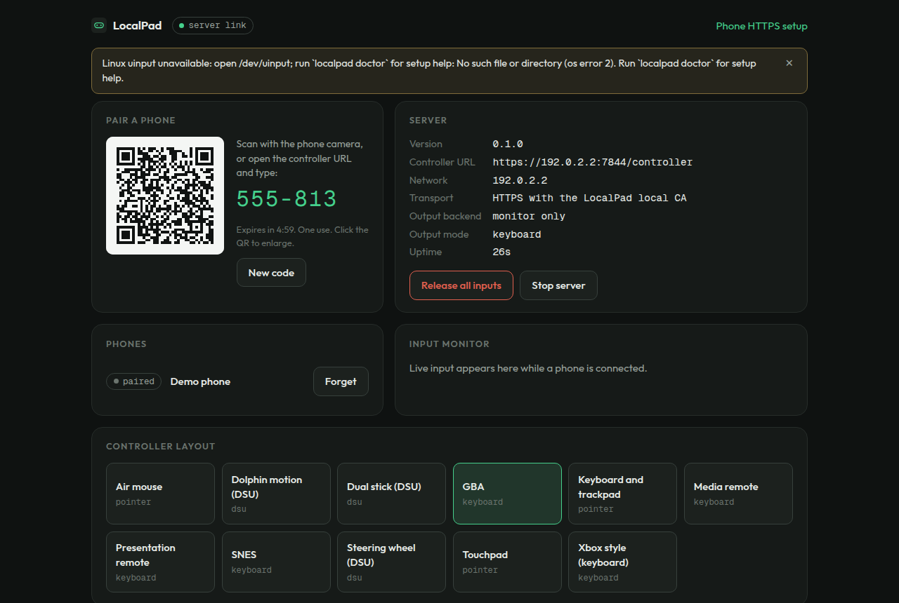
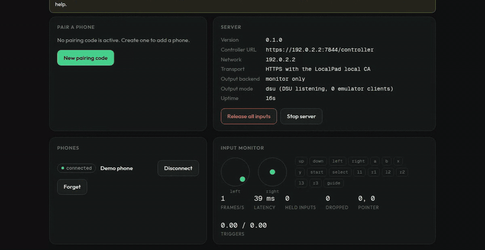
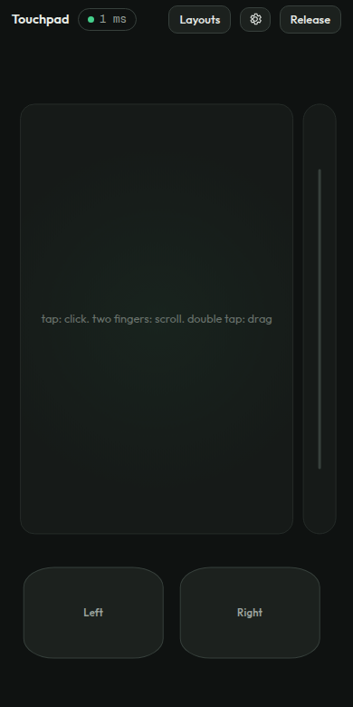
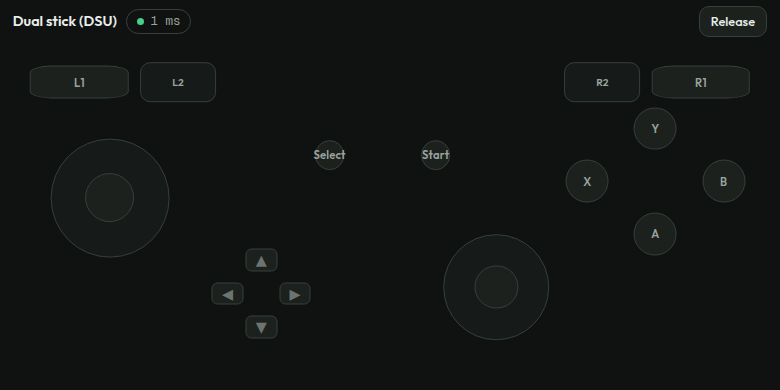
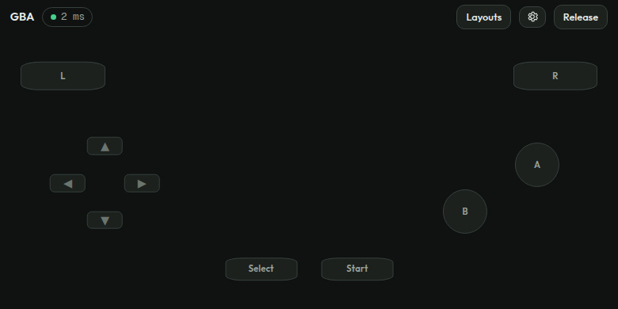
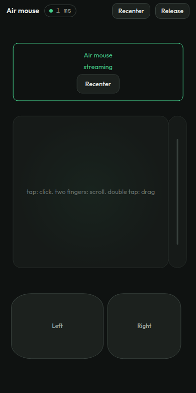
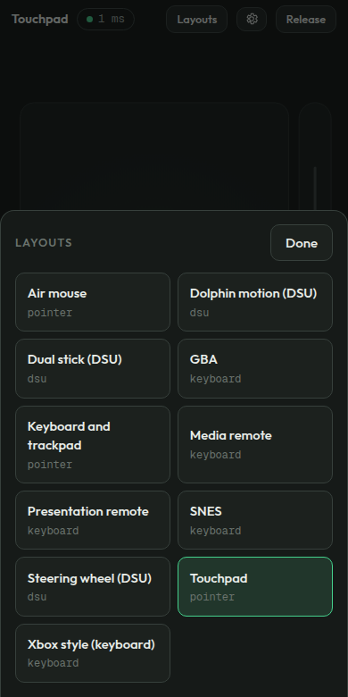
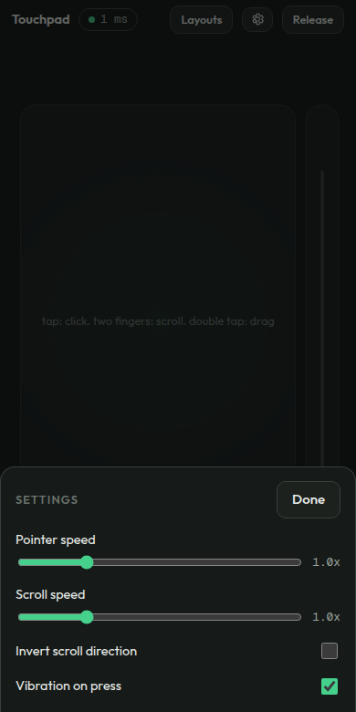

# LocalPad

Use your phone as a trackpad, keyboard, media remote, gamepad or motion
controller for a computer on the same Wi-Fi network. One Rust process, no
accounts, no cloud, no app store: the computer's browser is the dashboard
and the phone's browser is the controller.

```
$ localpad serve
LocalPad 0.1.0
Admin:       http://127.0.0.1:7843/admin
Controller:  https://192.168.1.20:7844/controller
Pairing:     592-184 (expires in 5 minutes)
Network:     192.168.1.20

[QR code]

Waiting for a controller... press Ctrl-C to stop.
```

Scan the QR code with the phone camera, tap Connect, and the phone becomes
whatever the active layout says: a touchpad, an air mouse, a GBA pad, a
steering wheel.



## Features

- Phone as trackpad, keyboard, media and presentation remote, gamepad or motion controller
- One command, zero installs on the phone: everything runs in the browser
- QR pairing with single-use codes; local network only, no cloud, no accounts
- Eleven built-in layouts, plus importable custom JSON layouts
- Air mouse: point the phone like a wand to move the cursor
- DSU (CemuHook) motion streaming for Dolphin and other emulators
- Live dashboard with input monitor, latency, device list and one-tap emergency release
- Switch layouts instantly from the phone or the dashboard
- Per-device settings: pointer speed, scroll speed and direction, vibration
- HTTPS out of the box through a private local certificate authority
- Every held key and button is released on disconnect, timeout or shutdown
- One small Rust binary for macOS, Windows and Linux; open source under Apache 2.0

## Demo

The phone drives the computer in real time; the dashboard mirrors every
input. Here the dual-stick controller feeds the input monitor, then the
layout is switched to GBA live from the dashboard:





| Touchpad | Dual stick (DSU) | GBA | Air mouse |
| --- | --- | --- | --- |
|  |  |  |  |

Layouts and preferences live on the phone too: the "Layouts" button
switches profiles without touching the computer, and the gear button
holds per-device pointer, scroll and vibration settings.

| Layout picker | Settings |
| --- | --- |
|  |  |

## Usage

1. **Start the server** on the computer:

   ```
   localpad serve
   ```

   The admin dashboard opens in your browser. The server resumes the
   last used layout; add `--profile gba` to pick one explicitly,
   `--no-open` to skip the browser, or `--require-approval` to confirm
   every phone on the dashboard before it can control anything.

2. **Connect the phone.** Scan the QR code with the phone camera (it
   carries a single-use secret), or open the controller URL and type the
   six digit code from the dashboard. The dashboard counts the code down
   live and offers a fresh one when it expires; click the QR to enlarge
   it for scanning from across the room. Re-pairing the same phone
   replaces its entry instead of listing it twice.

3. **Pick a layout.** Tap "Layouts" on the phone or use the dashboard's
   layout grid; either side switches instantly. The phone's gear button
   holds pointer speed, scroll speed, scroll direction and vibration
   preferences, remembered per device. `localpad profiles` lists layouts
   from the terminal.

4. **Trackpad gestures:** move with one finger, tap to click, two-finger
   drag to scroll, two-finger tap for right click, double-tap and hold to
   drag (the pad shows when a drag is active). Buttons give a short
   vibration where the browser supports it. The keyboard layout adds a
   "tap to type" strip that uses the phone's own keyboard.

   The controller goes fullscreen on the first touch. On iPhone, where
   Safari does not allow that, add the page to the Home Screen (Share,
   then Add to Home Screen) for the same effect.

5. **Motion layouts** (air mouse, Dolphin, steering wheel) need one
   extra step the first time: install the LocalPad certificate on the
   phone via the linked `/setup` page, then tap "Enable motion" when the
   layout asks. "Recenter" makes wherever you are pointing the neutral
   pose.

6. **Stop everything** with Ctrl-C, the dashboard's "Stop server"
   button, or `localpad stop`. Every held key, button and axis is
   released on disconnect, timeout or shutdown.

### Using the phone as an air mouse

Select the **Air mouse** profile: turning and tilting the phone moves the
cursor like a laser pointer, driven by the gyroscope's angular velocity
with a dead zone and smoothing so a resting hand does not drift. The same
screen keeps a touchpad for fine positioning, a scroll strip, and left
and right click buttons. Gyro aiming is also available inside other
layouts through the `gyro` binding: `"gyro": "mouse"` (pointer),
`"gyro": "right_stick"` (stick aim), `"gyro": "steer"` (steering axis)
or `"gyro": "dsu"` (raw calibrated motion for emulators).

## How it works

```
Rust CLI process
 ├── http://127.0.0.1:7843/admin   dashboard in the computer's browser
 ├── https://<lan-ip>:7844         controller + setup pages for phones
 │     └── /ws                     input WebSocket (60 Hz state frames)
 └── native output
       ├── macOS: CoreGraphics mouse/keyboard events
       ├── Windows: SendInput
       ├── Linux: /dev/uinput
       └── DSU (CemuHook) UDP server for Dolphin and other emulators
```

The phone streams normalized input frames (buttons, sticks, triggers,
pointer deltas, gyro quaternions) over a WebSocket. The server validates
and clamps every value, maps it through the active layout's bindings, and
drives the platform input APIs. Disconnects, timeouts, backgrounding and
shutdown all release every held key and button.

## Building

Requires Rust 1.85+ and Node 20+.

```
npm --prefix web install
npm --prefix web run build     # bundles the dashboard + controller UI
cargo build --release          # embeds web/dist into the binary
./target/release/localpad serve
```

`cargo test` runs the unit and integration suites, including a real
pairing + WebSocket session against ephemeral ports.

## CLI

```
localpad serve [--profile touchpad] [--admin-port 7843] [--controller-port 7844]
               [--no-open] [--require-approval] [--insecure-http]
               [--bind <ADDR>] [--allow-remote] [--no-native-output]
               [--log-level info]
localpad status | devices | profiles | pair | stop
localpad profile show <NAME>
localpad profile import <FILE>
localpad certificate install | export
localpad doctor
```

`localpad doctor` checks the network, ports, certificates and the
platform input backend (uinput permissions on Linux, the Accessibility
permission on macOS).

## Built-in layouts

| id | output | notes |
| --- | --- | --- |
| `touchpad` | pointer | tap to click, two-finger scroll, double-tap drag |
| `air-mouse` | pointer | gyro moves the cursor; touchpad and buttons included |
| `keyboard-trackpad` | pointer | trackpad plus the phone keyboard |
| `media-remote` | keyboard | play/pause, tracks, volume |
| `presentation` | keyboard | next/back, blank screen, start show |
| `gba` | keyboard | mGBA-style defaults (X/Z, A/S, Enter, Backspace) |
| `snes` | keyboard | six buttons plus shoulders |
| `xbox` | keyboard | WASD + mouse-on-right-stick mapping |
| `dual-stick` | dsu | generic pad streamed to DSU emulators |
| `dolphin` | dsu | Wii-style motion controller with calibrated gyro |
| `steering-wheel` | dsu | tilt to steer, pedal triggers |

Layouts are validated JSON (`layouts/*.json`, schema v1). Drop extra
layouts into the config directory's `layouts/` folder or use
`localpad profile import`.

## Motion controls and HTTPS

Browsers only expose the gyroscope in a secure context, and a LAN IP is
not "localhost" from the phone's point of view. On first run LocalPad
creates a local certificate authority, keeps the key on the computer with
owner-only permissions, and serves a per-boot leaf certificate for
`localpad.local` and the machine's current addresses. The `/setup` page
walks through trusting the public CA certificate on iPhone and Android
once; after that, motion layouts work in Safari and Chrome.

`--insecure-http` exists for development; motion layouts are disabled on
it because the browser will not grant sensor access.

For Dolphin: Options, Controllers, Alternate Input Sources, enable
DSU Client pointing at the computer's IP, port 26760. Select the
`dolphin` profile in the dashboard and the phone's buttons and motion
arrive as a full-gyro DSU pad.

## Security model

- The admin dashboard and its API bind to 127.0.0.1 only and are never
  mounted on the LAN listener. State-changing admin calls also require a
  custom header, so a web page cannot drive them cross-origin, and the
  Host header is checked against DNS rebinding.
- Pairing codes are single-use, expire after five minutes, and burn after
  five wrong guesses. Attempts are rate-limited per IP. Only hashes of
  pairing secrets and session tokens are kept in memory.
- Session tokens are 256-bit, scoped to one device and one server boot.
  Re-pairing a device revokes its previous tokens, and at most eight
  paired devices are remembered per boot.
- Every frame is validated: protocol version, button mask, NaN/infinity
  rejection, range clamps, sequence ordering, size caps and rate limits.
  Keyboard input is restricted to an allowlisted set of key codes.
- Binding to a non-private address requires `--allow-remote`.
- `--require-approval` shows each pairing on the dashboard before a token
  is issued.
- No third-party scripts, fonts or analytics; CSP on every response.

## Repository layout

```
crates/localpad-core          input model, layouts, mapping, motion, output trait
crates/localpad-server        axum listeners, pairing, sessions, TLS, mDNS
crates/localpad-cli           the `localpad` binary
crates/localpad-output-enigo  macOS (CoreGraphics) and Windows (SendInput) output
crates/localpad-output-linux  Linux uinput output
crates/localpad-output-dsu    DSU (CemuHook) motion server
web/                          React dashboard + controller (Vite, embedded at build)
layouts/                      built-in controller layouts (JSON, schema v1)
```

## Status and roadmap

This is the MVP described in the project specification: phases 1 through 4
(vertical slice, mouse/keyboard, TLS + motion, emulator support) are
implemented; macOS is the primary target with Linux uinput and Windows
SendInput adapters behind the same trait. Not yet here: virtual Xbox 360
output on Windows (ViGEm), multiple simultaneous phones, the visual layout
editor, signed installers and background service installation. On macOS,
gamepad-shaped layouts are keyboard mappings or DSU; a native virtual HID
controller depends on Apple's restricted entitlement and is intentionally
out of scope for now.

## License

Apache License 2.0. Copyright 2026 Lewis John Villamor. See
[LICENSE](LICENSE) for the full text.

## Support

If LocalPad is useful to you, you can
[buy me a coffee](https://www.paypal.com/paypalme/lewisjohnvillamor/250).
